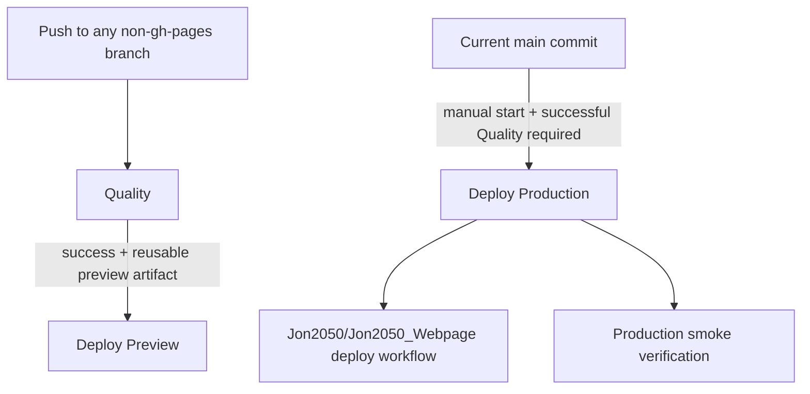

# CI/CD Pipelines

This document is the operational reference for the project-owned GitHub Actions in this repository.
It also explains the GitHub-managed Pages workflow that appears in the Actions UI.

## Workflow Graph

## Fixed URLs

- Main preview: `https://jon2050.github.io/Conspectus-Mobile/previews/main/`
- Shared non-main preview: `https://jon2050.github.io/Conspectus-Mobile/previews/test/`
- Production: `https://jon2050.de/conspectus/webapp/`

## Workflows

### `Quality`

- File: [`.github/workflows/quality.yml`](../.github/workflows/quality.yml)
- Trigger: every push to every branch except `gh-pages`
- Purpose:
  - validate formatting, linting, type safety, unit tests, preview build correctness, and Playwright smoke
  - produce the reusable `quality-preview-dist` artifact after `Build App (Preview)`
- Stage order:
  - `Detect Relevant Changes`
  - `Format, Lint, and Typecheck`
  - `Unit Tests`
  - `Build App (Preview)`
  - `Build Verification`
  - `E2E Smoke Tests`
  - `Quality Gate`
- Depends on: none
- Downstream dependencies:
  - `Deploy Preview`
  - `Deploy Production` (manual, current `main` commit only)
- Failure behavior:
  - if any quality job fails, no downstream preview deployment or manual production deployment can proceed for that commit
  - branches whose effective diff is docs-only skip the heavy jobs and therefore do not emit deployable artifacts
- Notes:
  - uses `actions/setup-node` npm cache and Playwright browser cache
  - cancels in-progress runs for the same ref via workflow concurrency
  - `Build Verification` checks preview build output base-path correctness, manifest `start_url` and `scope`, service worker scope, CSP presence, and root-path leakage
  - `Quality Gate` is the single branch-protection check that should be required on `main`

### `Deploy Preview`

- File: [`.github/workflows/deploy-preview.yml`](../.github/workflows/deploy-preview.yml)
- Trigger: successful `Quality` `workflow_run` events for push runs
- Purpose:
  - publish the verified preview artifact from `Quality` to GitHub Pages
  - deploy `main` to `/previews/main/`
  - deploy every non-`main` branch to the shared `/previews/test/` slot
- Depends on:
  - a successful `Quality` run
  - the presence of the `quality-preview-dist` artifact on that `Quality` run
- Failure behavior:
  - if GitHub Pages is unavailable or the preview URL does not become reachable in time, the workflow fails
  - if the triggering `Quality` run is no longer the current tip of its branch, the workflow exits cleanly without deploying
  - if the triggering `Quality` run did not produce a preview artifact, the workflow exits cleanly without deploying
- Notes:
  - reuses the built artifact from `Quality`; it does not rebuild
  - serializes preview deployments by fixed slot (`main` or `test`) to avoid races

### `Deploy Production`

- File: [`.github/workflows/deploy-production.yml`](../.github/workflows/deploy-production.yml)
- Trigger: manual `workflow_dispatch`
- Purpose:
  - confirm that the current `main` commit already has a successful `Quality` run
  - build the production app for `/conspectus/webapp/`
  - verify the production build output and append `deploy-metadata.json`
  - publish exactly one immutable artifact named `conspectus-mobile-production-<commitSha>` from the deploy run itself
  - verify website consumer contract compatibility
  - dispatch the deterministic handoff event to `Jon2050/Jon2050_Webpage`
  - wait for the live production site to expose the expected deploy identity
- Depends on:
  - manual operator start from `main`
  - a successful `Quality` run for the current `main` commit
  - repository secret `WEBSITE_REPO_DISPATCH_TOKEN`
- Failure behavior:
  - fails if started from a branch other than `main`
  - fails if the current `main` commit has no successful `Quality` run
  - fails if the production build, metadata generation, or artifact verification steps fail
  - fails if the website repo workflow contract is incompatible
  - fails if dispatch is rejected or if production smoke verification does not observe the expected `deploy-metadata.json`
- Notes:
  - rebuilds the app for production because the production base URL (`/conspectus/webapp/`) differs from the preview URLs
  - the website repo target defaults to `Jon2050/Jon2050_Webpage` and can be overridden with `WEBSITE_REPO_FULL_NAME`
  - production smoke target defaults to `https://jon2050.de/conspectus/webapp/` and can be overridden with `PRODUCTION_APP_BASE_URL`

## GitHub-Managed Pages Workflow

### `pages-build-deployment`

- Source: GitHub Pages, not this repository
- Trigger in the current setup: publishing updates from the `gh-pages` branch
- Purpose:
  - GitHub takes the committed `gh-pages` content and makes it available at the Pages site URL
- Notes:
  - this workflow is not defined in `.github/workflows/`
  - it cannot be renamed while the repository uses branch-based Pages publishing
  - it is an implementation detail of `Deploy Preview`, not one of the project-owned pipelines

## Artifact Contract

### `quality-preview-dist`

- Producer: `Quality`
- Consumer: `Deploy Preview` and `Quality` `E2E Smoke Tests`
- Contents: preview `dist/` for the fixed slot of the triggering branch

### `conspectus-mobile-production-<commitSha>`

- Producer: `Deploy Production`
- Consumer: the website repository deploy workflow
- Required metadata file: `deploy-metadata.json`
- Required metadata fields:
  - `channel`
  - `basePath`
  - `sourceBranch`
  - `commitSha`
  - `buildTimeUtc`
  - `qualityRunId`
  - `deployRunId`

## Repository Links

- Source repository: [Jon2050/Conspectus-Mobile](https://github.com/Jon2050/Conspectus-Mobile)
- Website consumer repository: [Jon2050/Jon2050_Webpage](https://github.com/Jon2050/Jon2050_Webpage)
- Website consumer workflow: [Jon2050/Jon2050_Webpage/.github/workflows/deploy.yml](https://github.com/Jon2050/Jon2050_Webpage/blob/master/.github/workflows/deploy.yml)
