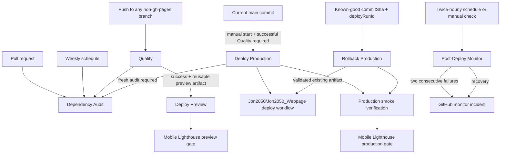

# CI/CD Pipelines

This document is the canonical operational reference for maintainers who change or diagnose this
repository's GitHub Actions. It defines workflow triggers, gates, artifacts, deployment channels,
and failure behavior. Release approval and execution remain owned by
[`Release-Process.md`](Release-Process.md). It also explains the GitHub-managed Pages workflow that
appears in the Actions UI.

Production workflow success is necessary but is not the complete release gate. Every production
release must follow the single checklist in [`Release-Process.md`](Release-Process.md), including
human release-owner acceptance and the physical-device evidence from
[`Manual-Device-QA.md`](Manual-Device-QA.md). The active default-branch ruleset strictly requires
the `Quality Gate`; the additional human and device gates are recorded in the release pull request.

## GitHub Action pinning

All third-party and GitHub-maintained actions in repository workflows are pinned to full commit SHAs with their reviewed release version in an adjacent comment. To update an action, review the upstream release and commit, replace both the SHA and version comment in every workflow use, run the local quality gate, and review the workflow diff before merging.

After these pinned workflows reach the default branch, repository administrators must enable **Require actions to be pinned to a full-length commit SHA** in **Settings → Actions → General**. That repository setting is intentionally applied after publication so it cannot block the unpinned workflow revision already on the default branch.

## Workflow Graph



## Fixed URLs

- Main preview: `https://jon2050.github.io/Conspectus-Mobile/previews/main/`
- Shared non-main preview: `https://jon2050.github.io/Conspectus-Mobile/previews/test/`
- Production: `https://jon2050.de/conspectus/`

## Workflows

### `Dependency Audit`

- File: [`.github/workflows/dependency-audit.yml`](../.github/workflows/dependency-audit.yml)
- Trigger: pull requests, weekly schedule, manual dispatch, and reusable calls from `Quality`
- Purpose:
  - scan the complete npm dependency tree, including development tooling
  - fail when npm reports a high or critical vulnerability
- Depends on: the committed `package-lock.json`
- Failure behavior:
  - a failed reusable call fails `Quality` and blocks preview and production eligibility
  - `Deploy Production` repeats the audit immediately before its build so newly published advisories fail closed
- Notes:
  - moderate and low findings remain visible but do not fail the M8-03 threshold
  - temporary exceptions require a narrowly scoped, reviewed, time-bounded entry in [`docs/security/Dependency-Vulnerability-Exceptions.md`](security/Dependency-Vulnerability-Exceptions.md); there are no active exceptions

### `Quality`

- File: [`.github/workflows/quality.yml`](../.github/workflows/quality.yml)
- Trigger: every push to every branch except `gh-pages`
- Purpose:
  - validate dependency security, formatting, linting, type safety, unit tests, preview build correctness, bundle size, and Playwright smoke
  - produce the reusable `quality-preview-dist` artifact after `Build App (Preview)`
- Stage order:
  - `Dependency Audit`
  - `Detect Relevant Changes`
  - `Format, Lint, and Typecheck`
  - `Unit Tests`
  - `Build App (Preview)`
  - `Build Verification`
  - `E2E Smoke Tests`
  - `Quality Gate`
- Depends on: none
- Downstream dependencies:
  - `Deploy Preview`
  - `Deploy Production` (manual, current `main` commit only)
- Failure behavior:
  - if any quality job, including the dependency audit, fails, no downstream preview deployment or manual production deployment can proceed for that commit
  - branches whose effective diff is docs-only skip the heavy jobs and therefore do not emit deployable artifacts
- Notes:
  - uses `actions/setup-node` npm cache and Playwright browser cache
  - cancels in-progress runs for the same ref via workflow concurrency
  - `Build Verification` checks the downloaded preview artifact against the JS/CSS bundle budgets before validating base-path correctness, manifest `start_url` and `scope`, `any` and `maskable` 192px/512px install-icon entries, service worker scope, the document CSP and artifact-owned Apache security headers, and root-path leakage
  - `Quality Gate` is the single branch-protection check that should be required on `main`

#### Bundle size budgets

`Build Verification` runs `npm run check:bundle-size` against the exact preview artifact produced
by `Build App (Preview)`. The checker recursively includes every `.js` and `.css` file under
`dist`, including generated service-worker and Workbox runtime files. WASM, source maps, images,
HTML, manifests, and other asset types are outside the M8-04 JS/CSS budget scope.

The committed limits in [`bundle-size-budgets.json`](../bundle-size-budgets.json) are aggregate
limits per asset class:

| Asset class |               Raw limit |              Gzip limit |
| ----------- | ----------------------: | ----------------------: |
| JavaScript  | 680 KiB (696,320 bytes) | 210 KiB (215,040 bytes) |
| CSS         |   30 KiB (30,720 bytes) |  5.75 KiB (5,888 bytes) |

Raw totals guard parse, storage, and uncompressed delivery cost. Gzip totals are calculated by
compressing each emitted file independently and summing the results, matching separate network
resources. A missing JS/CSS class or any exceeded limit fails `Build Verification`, which blocks
E2E, preview deployment, production eligibility, and the branch `Quality Gate`.

When a budget is exceeded:

1. Run `npm run build` and `npm run check:bundle-size` locally, then use the file-level report to
   identify the largest changed artifact.
2. Inspect the change or dependency that caused the growth and remove unused code or dependencies.
3. If the code is not needed during startup, use justified lazy loading or chunking and confirm the
   aggregate total actually improves.
4. Re-run the complete local quality gate.
5. Raise a limit only for intentional, reviewed product growth, and document the rationale in the
   pull request. Never raise a budget only to make CI green.

### `Deploy Preview`

- File: [`.github/workflows/deploy-preview.yml`](../.github/workflows/deploy-preview.yml)
- Trigger: successful `Quality` `workflow_run` events for push runs
- Purpose:
  - publish the verified preview artifact from `Quality` to GitHub Pages
  - deploy `main` to `/previews/main/`
  - deploy every non-`main` branch to the shared `/previews/test/` slot
  - run the mobile Lighthouse release gate against the reachable deployed route
- Depends on:
  - a successful `Quality` run
  - the presence of the `quality-preview-dist` artifact on that `Quality` run
- Failure behavior:
  - if GitHub Pages is unavailable or the preview URL does not become reachable in time, the workflow fails
  - if Lighthouse collection, live PWA checks, or a release threshold fails, the workflow and GitHub deployment record fail
  - if the triggering `Quality` run is no longer the current tip of its branch, the workflow exits cleanly without deploying
  - if the triggering `Quality` run did not produce a preview artifact, the workflow exits cleanly without deploying
- Notes:
  - reuses the built artifact from `Quality`; it does not rebuild
  - serializes preview deployments by fixed slot (`main` or `test`) to avoid races
  - always uploads the completed Lighthouse HTML/JSON reports, machine-readable result, and Markdown summary before enforcing the score result

### `Deploy Production`

- File: [`.github/workflows/deploy-production.yml`](../.github/workflows/deploy-production.yml)
- Trigger: manual `workflow_dispatch`
- Purpose:
  - confirm that the current `main` commit already has a successful `Quality` run
  - re-scan dependencies immediately before building to catch advisories published after `Quality`
  - build the production app for `/conspectus/`
  - verify the production build output and append `deploy-metadata.json`
  - publish exactly one immutable artifact named `conspectus-mobile-production-<commitSha>` from the deploy run itself
  - verify website consumer contract compatibility
  - dispatch the deterministic handoff event to `Jon2050/Jon2050_Webpage`
  - wait for the live production site to expose the expected deploy identity
  - run the mobile Lighthouse release gate against the verified live production route
- Depends on:
  - manual operator start from `main`
  - a successful `Quality` run for the current `main` commit
  - repository secret `WEBSITE_REPO_DISPATCH_TOKEN`
- Failure behavior:
  - fails if started from a branch other than `main`
  - fails if the current `main` commit has no successful `Quality` run
  - fails if the fresh dependency audit reports a high or critical vulnerability
  - fails if the production build, metadata generation, or artifact verification steps fail
  - fails if the website repo workflow contract is incompatible
  - fails if dispatch is rejected or if production smoke verification does not observe the expected `deploy-metadata.json`
  - fails if Lighthouse collection, live PWA checks, or a release threshold fails
- Notes:
  - rebuilds the app for production because the production base path (`/conspectus/`) differs from the preview URLs
  - the website repo target defaults to `Jon2050/Jon2050_Webpage` and can be overridden with `WEBSITE_REPO_FULL_NAME`
  - production smoke target defaults to `https://jon2050.de/conspectus/` and can be overridden with `PRODUCTION_APP_BASE_URL`
  - the production artifact is a static PWA scoped to `/conspectus/` on `jon2050.de`; the website consumer validates `index.html`, the document CSP, and the optional `.htaccess` defense-in-depth headers before upload
  - production smoke validates the live document CSP, referrer-policy meta tag, padded Apple touch icon, and reachable `any` plus `maskable` 192px/512px manifest icons without requiring PHP or hosting-package response-header support
  - the CSP keeps general JavaScript evaluation disabled while allowing the narrower WebAssembly permission required by sql.js plus the Microsoft login, Graph, and OneDrive download endpoints used by the app
  - the current free host does not emit runtime CSP, `X-Content-Type-Options`, or `Referrer-Policy` response headers; the owner accepted this documented MVP limitation on 2026-07-22, while the document policies and optional artifact-owned `.htaccess` remain enforced by build and smoke contracts
  - the footer fetches `deploy-metadata.json` with browser caching disabled so a newly deployed identity is not hidden by an older cached metadata response
  - service-worker updates remain prompt-based: an open client shows **Update now** instead of replacing the running shell automatically, protecting unsaved transfer state; closing all app tabs and reopening also lets an activated update take control
  - Lighthouse runs only after production smoke observes the expected commit and deploy-run identity; a failure blocks release acceptance but does not attempt an automatic rollback

### `Rollback Production`

- File: [`.github/workflows/rollback-production.yml`](../.github/workflows/rollback-production.yml)
- Trigger: pull requests that change the rollback contract, or manual dispatch with a known-good
  `commitSha`, `deployRunId`, and explicit execute choice
- Purpose:
  - prove that a historical successful `main` production artifact is still available and unexpired
  - verify the exact run provenance, artifact metadata, and current website-consumer contract
  - support a no-mutation dry run before releases and before an incident rollback
  - in execute mode, redispatch the validated existing artifact and require production smoke checks
    to observe its exact identity
- Depends on:
  - an unexpired `conspectus-mobile-production-<commitSha>` artifact from the selected successful
    `Deploy Production` run
  - repository secret `WEBSITE_REPO_DISPATCH_TOKEN`
  - the compatible `Jon2050/Jon2050_Webpage` consumer workflow
- Failure behavior:
  - rejects malformed inputs, non-`main` or unsuccessful producer runs, missing/expired artifacts,
    metadata mismatches, consumer-contract drift, dispatch errors, and live identity mismatches
  - never dispatches in pull-request or manual dry-run mode
  - execution is main-only, serialized with production deployment, and never cancels an active run
- Notes:
  - rollback reuses immutable Actions artifacts and repository dispatch; it performs no manual FTP or
    filesystem operation
  - live verification retries for at most eight minutes, leaving time for the incident procedure in
    [`Production-Rollback.md`](Production-Rollback.md) to complete inside 15 minutes
  - artifact retention is 90 days, so release preparation must confirm at least one recent
    known-good rollback target

### `Post-Deploy Monitor`

- File: [`.github/workflows/post-deploy-monitor.yml`](../.github/workflows/post-deploy-monitor.yml)
- Trigger: scheduled at minutes 7 and 37 of every hour, or manual `workflow_dispatch` from `main`
- Purpose:
  - discover the exact live `commitSha`, `deployRunId`, and `qualityRunId` from production metadata
  - run the same app-route, manifest, service-worker, icon, scope, document-policy, and identity
    checks used after production deployment
  - retain machine-readable result and state evidence for 30 days
  - open or update one GitHub incident after two consecutive failures and close it after recovery
- Depends on:
  - the production route at `https://jon2050.de/conspectus/`
  - the live `deploy-metadata.json` identity generated by `Deploy Production`
  - GitHub Actions cache state on `main` for the consecutive-failure count and last-known-success
    identity
- Failure behavior:
  - the first failed run records evidence and fails without opening an incident
  - the second consecutive failed run creates the incident; later failures add comments to it
  - a successful run resets the counter and comments on and closes any open monitor incident
  - a complete production outage uses the last-known-success identity in the alert so the source
    artifact and deploy run remain actionable
- Notes:
  - runs are serialized so scheduled and manual checks cannot race the failure counter
  - the workflow rejects non-`main` manual runs before restoring shared monitor state or mutating
    the incident lifecycle
  - manual `simulate_failure=true` still runs the real smoke first, then records a controlled
    failure; run it twice to verify alert creation and follow with a normal manual run to verify
    recovery and incident closure
  - incident creation and comments always use Markdown body files; no alert payload is assembled
    with escaped newline strings

### Lighthouse mobile release budgets

Both deployment workflows run the pinned Lighthouse CLI three times with its mobile profile against
the real deployed HTTPS route. Category thresholds use the median of the three runs to reduce normal
measurement variance. Deterministic audits must pass in every run.

| Check           | Minimum | Aggregation |
| --------------- | ------: | ----------- |
| Performance     |     80% | Median      |
| Accessibility   |     90% | Median      |
| Best Practices  |     90% | Median      |
| HTTPS           |    100% | Every run   |
| Mobile viewport |    100% | Every run   |

The release runner also checks the deployed same-origin PWA manifest, route-correct `start_url` and
scope, browser-confirmed service-worker registration/scope, and required 192px/512px install icons.
These checks replace the deprecated Lighthouse PWA category; the project does not invent a
synthetic replacement score.

Each run appends a score table to the GitHub Actions summary and uploads its HTML/JSON reports plus
machine-readable summary for 90 days. Preview artifacts are named
`lighthouse-preview-<slot>-<commitSha>` and production artifacts are named
`lighthouse-production-<commitSha>`. The report upload executes before final threshold enforcement,
so evidence remains available when a measured score fails.

To reproduce a deployed-route check locally with Chrome/Chromium installed:

```sh
npm run check:lighthouse -- https://jon2050.github.io/Conspectus-Mobile/previews/test/
```

## GitHub-Managed Pages Workflow

### `pages-build-deployment`

- Source: GitHub Pages, not this repository
- Trigger in the current setup: publishing updates from the `gh-pages` branch
- Purpose:
  - GitHub takes the committed `gh-pages` content and makes it available at the Pages site URL
- Notes:
  - this workflow is not defined in `.github/workflows/`
  - it cannot be renamed while the repository uses branch-based Pages publishing
  - it is an implementation detail of `Deploy Preview`, not one of the project-owned pipelines

## Artifact Contract

### `quality-preview-dist`

- Producer: `Quality`
- Consumer: `Deploy Preview` and `Quality` `E2E Smoke Tests`
- Contents: preview `dist/` for the fixed slot of the triggering branch

### `conspectus-mobile-production-<commitSha>`

- Producer: `Deploy Production`
- Consumers: the website repository deploy workflow and `Rollback Production`
- Required metadata file: `deploy-metadata.json`
- Required Apache security configuration: `.htaccess`
- Required static app-shell entrypoint: `index.html`
- Required metadata fields:
  - `channel`
  - `basePath`
  - `sourceBranch`
  - `commitSha`
  - `buildTimeUtc`
  - `qualityRunId`
  - `deployRunId`

### `lighthouse-preview-<slot>-<commitSha>` / `lighthouse-production-<commitSha>`

- Producers: `Deploy Preview` and `Deploy Production`
- Contents: three mobile Lighthouse HTML/JSON reports, `summary.json`, and `summary.md`
- Retention: 90 days
- Failure behavior: reports remain available when collection completed but a release threshold failed

## Repository Links

- Source repository: [Jon2050/Conspectus-Mobile](https://github.com/Jon2050/Conspectus-Mobile)
- Website consumer repository: [Jon2050/Jon2050_Webpage](https://github.com/Jon2050/Jon2050_Webpage)
- Website consumer workflow: [Jon2050/Jon2050_Webpage/.github/workflows/deploy.yml](https://github.com/Jon2050/Jon2050_Webpage/blob/master/.github/workflows/deploy.yml)
