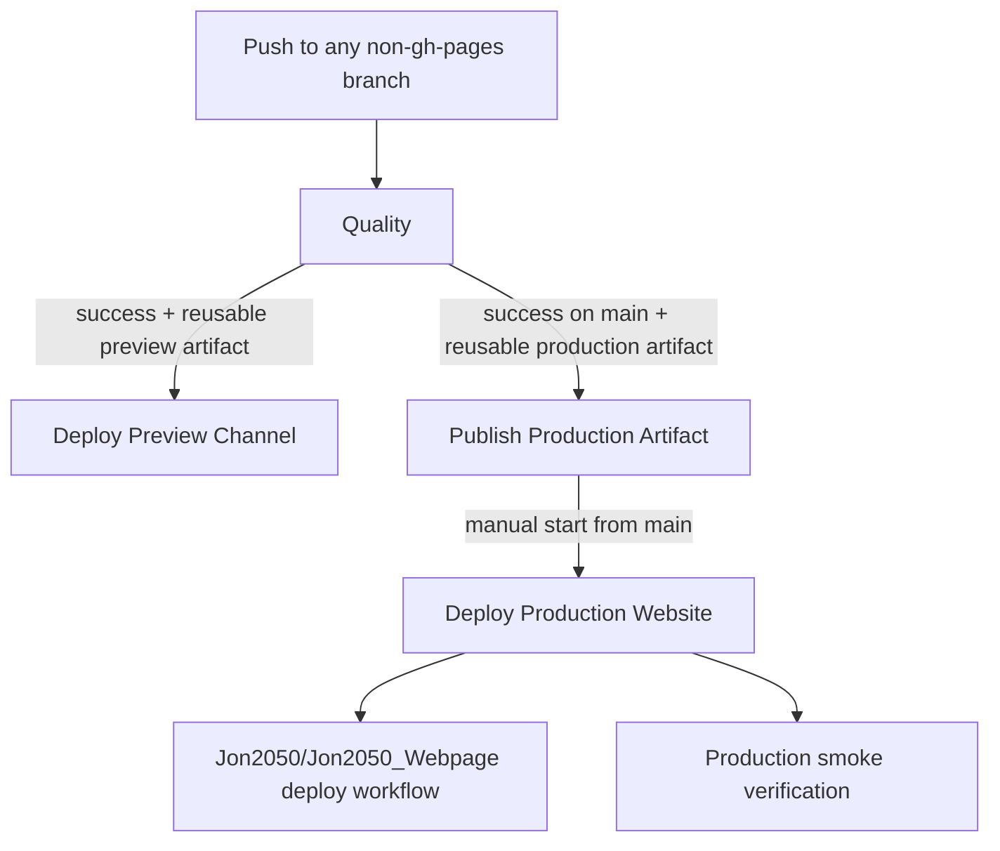

# CI/CD Pipelines

This document is the operational reference for all GitHub Actions in this repository.

## Workflow Graph

## Fixed URLs

- Main preview: `https://jon2050.github.io/Conspectus-Mobile/previews/main/`
- Shared non-main preview: `https://jon2050.github.io/Conspectus-Mobile/previews/test/`
- Production: `https://jon2050.de/conspectus/webapp/`

## Workflows

### `Quality`

- File: [`.github/workflows/quality.yml`](../.github/workflows/quality.yml)
- Trigger: every push to every branch except `gh-pages`
- Purpose:
  - validate formatting, linting, type safety, unit tests, build-channel correctness, and Playwright smoke
  - produce reusable `quality-production-dist` and `quality-preview-dist` artifacts after successful build verification
- Depends on: none
- Downstream dependencies:
  - `Deploy Preview Channel`
  - `Publish Production Artifact`
- Failure behavior:
  - if any quality job fails, no downstream preview deployment or production artifact publication can proceed for that commit
  - docs-only pushes skip the heavy jobs and therefore do not emit deployable artifacts
- Notes:
  - uses `actions/setup-node` npm cache and Playwright browser cache
  - cancels in-progress runs for the same ref via workflow concurrency

### `Deploy Preview Channel`

- File: [`.github/workflows/deploy-preview.yml`](../.github/workflows/deploy-preview.yml)
- Trigger: successful `Quality` `workflow_run` events for push runs
- Purpose:
  - publish the verified preview artifact from `Quality` to GitHub Pages
  - deploy `main` to `/previews/main/`
  - deploy every non-`main` branch to the shared `/previews/test/` slot
- Depends on:
  - a successful `Quality` run
  - the presence of the `quality-preview-dist` artifact on that `Quality` run
- Failure behavior:
  - if GitHub Pages is unavailable or the preview URL does not become reachable in time, the workflow fails
  - if the triggering `Quality` run is no longer the current tip of its branch, the workflow exits cleanly without deploying
  - if the triggering `Quality` run did not produce a preview artifact, the workflow exits cleanly without deploying
- Notes:
  - reuses the built artifact from `Quality`; it does not rebuild
  - serializes preview deployments by fixed slot (`main` or `test`) to avoid races

### `Publish Production Artifact`

- File: [`.github/workflows/publish-production-artifact.yml`](../.github/workflows/publish-production-artifact.yml)
- Trigger: successful `Quality` `workflow_run` events for push runs on `main`
- Purpose:
  - reuse the verified production build from `Quality`
  - append `deploy-metadata.json`
  - publish exactly one immutable artifact named `conspectus-mobile-production-<commitSha>`
- Depends on:
  - a successful `Quality` run on `main`
  - the presence of the `quality-production-dist` artifact on that `Quality` run
- Failure behavior:
  - if metadata generation or artifact verification fails, the workflow fails and no production handoff artifact is published
  - if the triggering `Quality` run is no longer the current `main` tip, the workflow exits cleanly without publishing
  - if the triggering `Quality` run did not produce a production artifact, the workflow exits cleanly without publishing
- Notes:
  - this workflow is the producer for the website repo handoff contract
  - artifact retention is 90 days

### `Deploy Production Website`

- File: [`.github/workflows/deploy-production-website.yml`](../.github/workflows/deploy-production-website.yml)
- Trigger: manual `workflow_dispatch`
- Purpose:
  - resolve the successful `Publish Production Artifact` run for the current `main` commit
  - verify artifact metadata and website consumer contract
  - dispatch the deterministic handoff event to `Jon2050/Jon2050_Webpage`
  - wait for the live production site to expose the expected deploy identity
- Depends on:
  - manual operator start from `main`
  - at least one successful `Publish Production Artifact` run on `main`
  - repository secret `WEBSITE_REPO_DISPATCH_TOKEN`
- Failure behavior:
  - fails if started from a branch other than `main`
  - fails if the current `main` commit has no successful published production artifact
  - fails if the website repo workflow contract is incompatible
  - fails if dispatch is rejected or if production smoke verification does not observe the expected `deploy-metadata.json`
- Notes:
  - uses the already-built artifact; it never rebuilds `main`
  - the website repo target defaults to `Jon2050/Jon2050_Webpage` and can be overridden with `WEBSITE_REPO_FULL_NAME`
  - production smoke target defaults to `https://jon2050.de/conspectus/webapp/` and can be overridden with `PRODUCTION_APP_BASE_URL`

## Artifact Contract

### `quality-preview-dist`

- Producer: `Quality`
- Consumer: `Deploy Preview Channel`
- Contents: verified preview `dist/` for the fixed slot of the triggering branch

### `quality-production-dist`

- Producer: `Quality`
- Consumer: `Publish Production Artifact`
- Contents: verified production `dist/` before handoff metadata is appended

### `conspectus-mobile-production-<commitSha>`

- Producer: `Publish Production Artifact`
- Consumer: `Deploy Production Website` and the website repository deploy workflow
- Required metadata file: `deploy-metadata.json`
- Required metadata fields:
  - `channel`
  - `basePath`
  - `sourceBranch`
  - `commitSha`
  - `buildTimeUtc`
  - `qualityRunId`
  - `deployRunId`

## Repository Links

- Source repository: [Jon2050/Conspectus-Mobile](https://github.com/Jon2050/Conspectus-Mobile)
- Website consumer repository: [Jon2050/Jon2050_Webpage](https://github.com/Jon2050/Jon2050_Webpage)
- Website consumer workflow: [Jon2050/Jon2050_Webpage/.github/workflows/deploy.yml](https://github.com/Jon2050/Jon2050_Webpage/blob/master/.github/workflows/deploy.yml)
